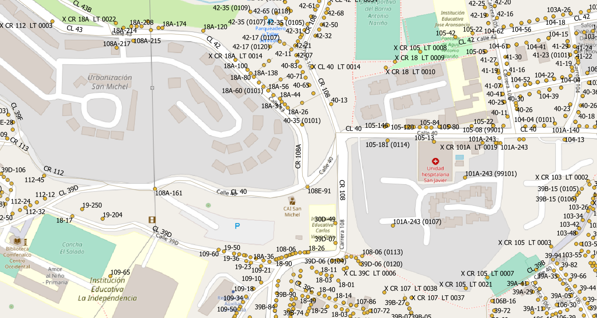

# Tareas
  
Los nombres de las carreteras van seguidos de nombres como: calle, carrera, diagonal y transversal junto con un número de placa. Puede tener letra o bis índice. 
La numeración del edificio tiene un complemento de letras y un complemento al número de metros que el edificio hace esquina.
# Extracción
A continuación se muestran los pasos para la extracción por tipo de datos relevantes.
## Via
SRID:  4326
1. Abrir`Malla_Vial_Integral_Bogota_D_C-shp.zip`.
2. Selecciona archivos `Malla_Vial_Integral_Bogota_D_C.*`.
3. Copie los archivos seleccionados al directorio de destino.
### Datos relevantes
columnas:
* `TIPO_VIA`(string):  tipo de via.
* `LABEL`(string):  nome de via.
* `NOMBRE_COM`(string): nombre alternativo, si es nulo, use otro campo.

Ejemplos 
CL 41 = Calle 41
Quito = Calle 42

## punto de dirección
SRID: 4326
1. Abrir `Nomenclatura_Domiciliaria.zip`.
2. Selecciona archivos `Nomenclatura_Domiciliaria.*`.
3. Copie los archivos seleccionados al directorio de destino.

### Datos relevantes
columnas:
* `TIPO_VIA`(string): tipo de via.
* `LABEL`(string):  nome de via
* `NOMBRE_COM` (string): nombre alternativo
* `PLACA` (string): numeración de edificios
* `TIPO_CRUCE` (string): ayuda con los filtros

# Evidências de teste
Teste no QGIS:

# Make

Para generar todas las capas descritas aquí, `make all_layers`. Todos los datos del "original filtrado" se escribirán en las tablas `ingest.layer_file` e` ingest.feature_asis`.

Para la generación de una sola capa o la descarga de datos de otra fuente, o el uso de una base que no sea `ingest1`, use demasiados parámetros. Ejemplo: `make pg_db=ingest2 orig=/tmp/sandOrig nsvia_full`.
